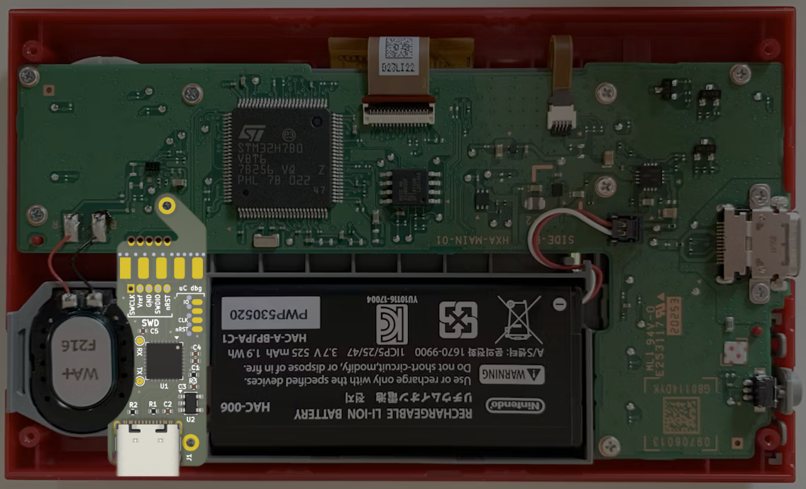
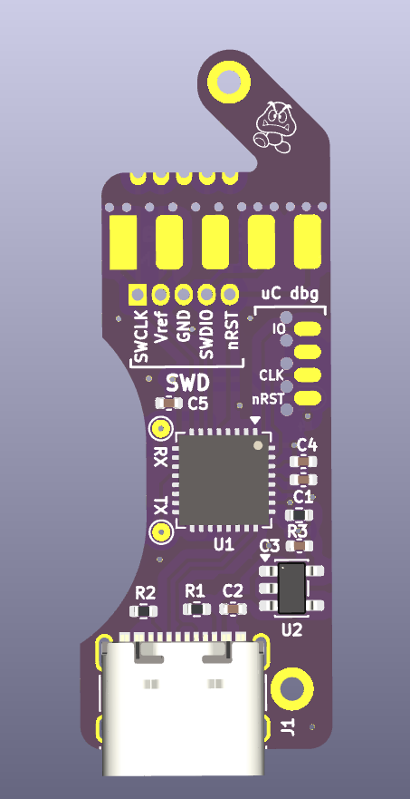
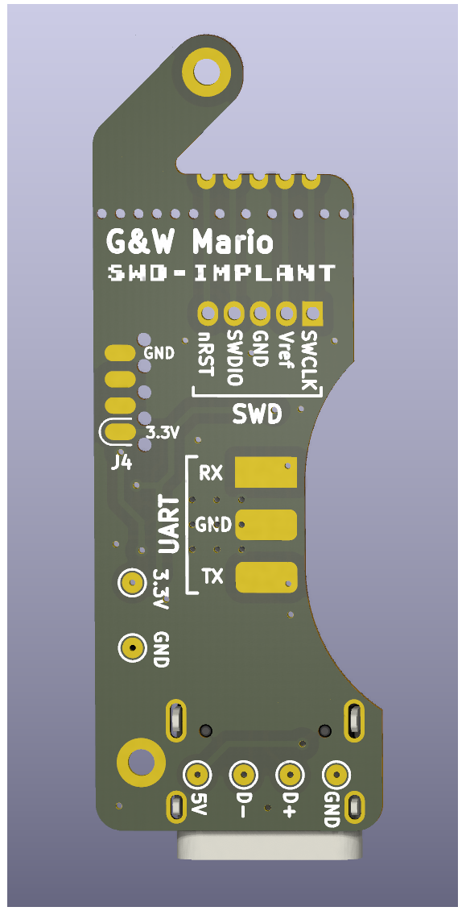
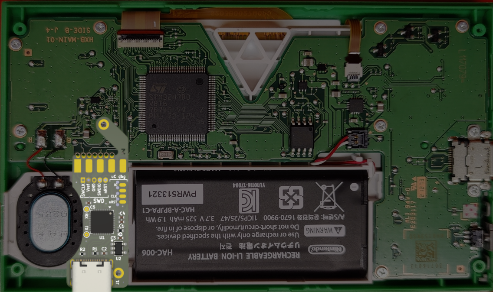
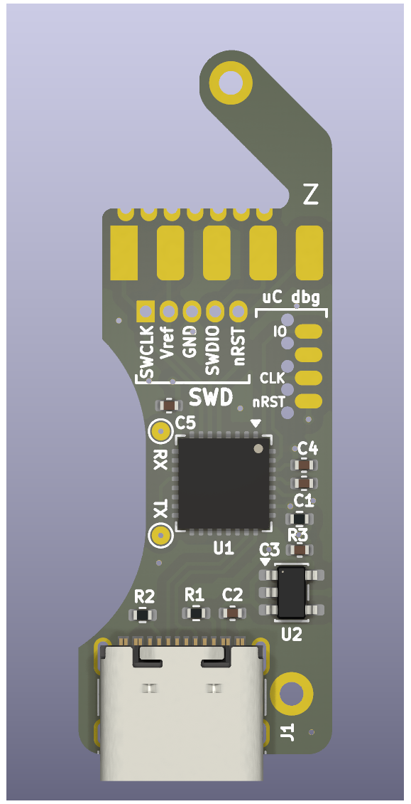
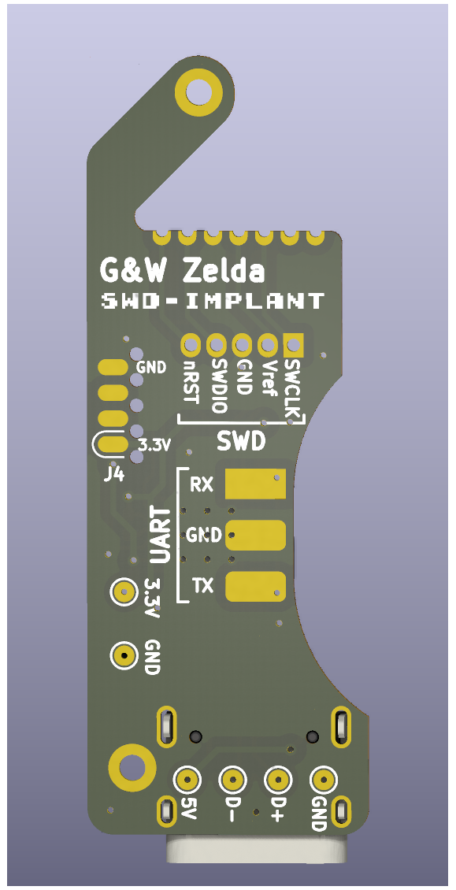

# Game & Watch SWD-Implant

A small [DAP-Link](https://github.com/ARMmbed/DAPLink) SWD programmer/debugger that fits insight a Nintendo® Game & Watch™ (2020/2021).

This is forked from [UlfWetzker/game-and-watch-swd-implant](https://github.com/UlfWetzker/game-and-watch-swd-implant), which has some issues and appears to be unmaintained.

## Mario (2020)

  
  

## Zelda (2021)

  
  

## Implant Firmware

The implant board itself uses a [SAMD21](https://www.microchip.com/en-us/product/atsamd21g18) microcontroller, which is flashed with the [DAP-Link](https://github.com/ARMmbed/DAPLink) firmware. It is then able to act as a flasher for the G&W [STM32](https://www.st.com/en/microcontrollers-microprocessors/stm32-32-bit-arm-cortex-mcus.html) CPU. Flashing both the implant and the G&W is done using [OpenOCD](https://openocd.org/).

## G&W Firmware

The go-to firmware for these consoles is "RetroGo":
- [Original](https://github.com/kbeckmann/game-and-watch-retro-go): archived now
- [Zeus Fork](https://github.com/olderzeus/game-and-watch-retro-go): Adds more consoles
- [Sylverb Fork](https://github.com/sylverb/game-and-watch-retro-go): Adds yet more consoles, as well as support for LttP and SMW.

## Other Links

- SD Card mod: [link](https://github.com/sylverb/game-and-watch-retro-go-sd)
- Original homebrew work: [link](https://github.com/ghidraninja/game-and-watch-backup)
- Various firmware and utilities: [link](https://www.schuerewegen.tk/gnw/)
- A good tutorial on modding & flashing: [link](https://psxtools.de/forum/index.php?thread/87820-tutorial-zelda-mario-game-and-watch-64mb-upgrade-dualboot-ofw-retro-go/) (German)
